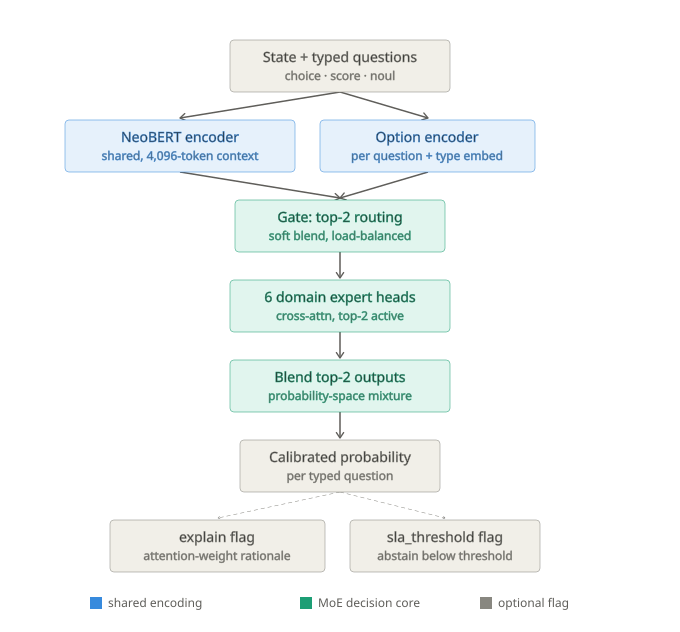

# Mosaic

A wide-domain "System 1" typed-decision model. Give it a state (a support ticket,
an email, a security alert, a product review — text or JSON) and one or more typed
questions (`choice`, `score`, or `noul`), and it returns calibrated probabilities in a
single forward pass. No text generation, nothing to hallucinate.

Mosaic competes directly with two other System 1 models that launched in September
2026: TypeSafe AI's **Jev** (closed, hosted-API-only) and Convai's **Laya** (open,
Apache 2.0, one shared head). Where Mosaic differs: instead of one generalist head
trying to be good at everything, it routes each request through a small,
learned mixture of domain-specialist experts — six tiles that combine into one
answer, which is where the name comes from.

## Why this exists

Laya and Jev proved the category works: a pretrained encoder plus a lightweight
decision head, trained against a strictly proper scoring rule, beats using a full LLM
for structured classification — 100-400x cheaper, single-digit-millisecond latency,
genuinely calibrated probabilities instead of a confident-sounding guess. But both
ship as a single generalist model. Widen a generalist's scope and its per-domain
accuracy usually pays for it — the "jack of all trades" tax. Mosaic's bet is that a
**Mixture-of-Experts router** removes that tax: one shared encoder, several small
domain-expert heads, a cheap gate that blends the top few for each request.

## Architecture



State and typed questions flow through a shared NeoBERT encoder (run once, not once
per question) and a separate option encoder, into a soft top-2 gate over six domain
expert heads, blended in probability space into one calibrated output — with
`explain` and `sla_threshold` as optional flagged branches off the result.

Every architectural choice was made deliberately *not* to be a port of Laya's design
— own sequence encoding, own gating mechanism, own expert-head mechanism (adapted from
[poly-encoders](https://arxiv.org/abs/1905.01969), not Laya's mask-marker-in-one-sequence
approach), own reward formulation. The reasoning for each is written up in full:

| Decision | Doc |
|---|---|
| Encoder choice (NeoBERT, not ModernBERT) | [`docs/architecture-decisions.md`](docs/architecture-decisions.md) |
| Gating (soft top-2, load-balanced) | [`docs/architecture-decisions.md`](docs/architecture-decisions.md) |
| Expert head (poly-encoder-style cross-attention) | [`docs/expert-head-design.md`](docs/expert-head-design.md) |
| Reward (Brier + RPS + MMCE, not one fixed combo) | [`docs/reward-design.md`](docs/reward-design.md) |
| Local/offline serving as a first-class target | [`docs/local-serving.md`](docs/local-serving.md) |
| Code layout, module by module | [`docs/code-structure.md`](docs/code-structure.md) |
| Every library and why | [`docs/tech-stack.md`](docs/tech-stack.md) |

## The six domains

| Domain | `choice` | `score` | `noul` |
|---|---|---|---|
| Customer support triage | real | synthetic | real |
| Trust & safety / content moderation | — | real | real |
| Email / communication | real | synthetic | real |
| Sales / CRM | real | synthetic | real |
| Security operations / alert triage | real | real | real |
| E-commerce | real | real | synthetic |

Every gap is either closed with a second real data source or a synthetic generator
(explicitly tagged `license: "synthetic"` so it's never confused with real signal) —
never a forced proxy label standing in for data that doesn't exist. The one remaining
gap (trust-safety's `choice`) is documented, not hidden: Civil Comments is a
severity-scoring dataset with no natural category label. Full reasoning per domain,
including every dataset actually verified to exist (not recalled from memory) with its
license and fit, is in [`research/`](research/) and the coverage notes in
[`PLAN.md`](PLAN.md).

## Project status

Design (architecture, code layout, tooling) is fully resolved. Implementation is
underway and validated at each stage with real data and real code, not just plans:

- **Phase 0 — Research**: competitive architecture study (reading Laya's actual
  published source), domain selection, dataset verification. Done.
- **Phase 1 — Data pipeline**: all six domains have working loaders pulling real,
  live, licensed data end-to-end, full `choice`/`score`/`noul` coverage. Done.
- **Phase 2 — Single-expert baseline**: encoder, option encoder, and expert head
  built and running against real NeoBERT weights. A CPU smoke test proved gradients
  flow correctly (mean reward 0.284 → 0.637 over 10 steps). Pipeline proven; not a
  convergence run. See [`docs/phase2-notes.md`](docs/phase2-notes.md).
- **Phase 3 — MoE router**: gate + 6 expert heads + MoE-aware reward (load balancing,
  per-expert auxiliary reward) built and tested. A held-out evaluation on real data
  showed genuine generalization (accuracy 0.350 → 0.450, ECE 0.133 → 0.104 on data
  never trained on). See [`docs/phase3-notes.md`](docs/phase3-notes.md).
- **Phase 4-6 — Feature flags, benchmarking, serving**: designed, not yet built.

**164 tests passing.** Every non-trivial function — the reward's strict-properness,
the gate's load balancing, padding-exclusion in pooling, the option/state cross-attention
masking — is verified by a test that checks an actual correctness property, not just
that the code runs. Several real bugs were caught this way before they reached a real
run: a data-sampling bug that silently returned only one domain, a metrics
double-normalization bug, an SVG/formula edge case, and others — see each phase's
notes doc for the full account.

Full phase-by-phase detail, open questions, and the domain-tiering roadmap beyond the
six v1 domains: [`PLAN.md`](PLAN.md).

## Repo layout

```
mosaic/
  PLAN.md                    full project plan, phase-by-phase status
  README.md                  this file
  pyproject.toml
  src/decision_engine/        # package name kept from before the "Mosaic" rename --
    data/                     #   see note below
      schema.py                unified {state, question, target} record type
      loaders/                 one real-data loader per domain
      synth/                   synthetic generators for confirmed data gaps
    model/
      encoder.py                NeoBERT wrapper
      option_encoder.py         per-option query construction
      single_head.py            poly-encoder-style cross-attention expert head
      gate.py                   soft top-k MoE gate + load-balancing loss
      moe_model.py               ties encoder + gate + experts together
      baseline_model.py          Phase 2 single-head model (no MoE)
    training/
      reward.py                  Brier / RPS / MMCE, single-head and MoE-aware losses
      dataset.py                  JSONL loading, collation, train/val split
      metrics.py                  accuracy, expected calibration error
      loop.py / moe_loop.py       training loops
  scripts/                    train.py, train_moe.py, train_moe_eval.py
  tests/unit/                 164 tests
  data/<domain>/              generated training data (JSONL)
  docs/                       architecture, design, and implementation-notes docs
  research/                   Jev/Laya study, dataset verification per domain
```

**A note on the name change**: the Python package is still importable as
`decision_engine` — only the project's external name (`pyproject.toml`'s `name` field,
and everything user-facing) changed to Mosaic. Renaming the internal import path
across every module would be a large, purely cosmetic, higher-risk change; it's a
deliberate choice to keep the two separate; happy to do the full rename later if you
want complete consistency.

## Quickstart

```bash
# environment (Python 3.11+; uv is much faster than plain pip for this)
uv venv --python 3.11 .venv
uv pip install --python .venv/Scripts/python.exe -e .
uv pip install --python .venv/Scripts/python.exe torch --index-url https://download.pytorch.org/whl/cpu
uv pip install --python .venv/Scripts/python.exe transformers accelerate einops safetensors xformers pytest

# run the test suite
.venv/Scripts/python.exe -m pytest tests/unit -q

# pull real data for one domain (hits a live public API, no auth needed)
.venv/Scripts/python.exe -m decision_engine.data.loaders.customer_support

# run the Phase 2 / Phase 3 smoke tests (CPU; downloads NeoBERT on first run, ~1GB)
.venv/Scripts/python.exe scripts/train.py            # single-head baseline
.venv/Scripts/python.exe scripts/train_moe.py         # MoE router
.venv/Scripts/python.exe scripts/train_moe_eval.py    # MoE + real held-out accuracy/ECE
```

Real training (as opposed to the CPU correctness checks above) needs rented GPU
compute — this model is small enough (~250M params) to train on a single free-tier
T4, e.g. via Kaggle's free 30 GPU-hours/week, the same setup Laya's own team used for
their fine-tuning notebook. Step-by-step Kaggle/Colab setup:
[`docs/cloud-training.md`](docs/cloud-training.md).

## Competitive context

Read alongside this repo, not as marketing copy — the actual technical notes from
studying both competitors' public material (Laya's source was fully readable; Jev's
architecture is undisclosed beyond a marketing blog post) live in
[`research/laya-jev-notes.md`](research/laya-jev-notes.md), including the explicit
list of what Mosaic does differently and why.
